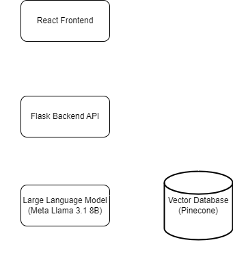
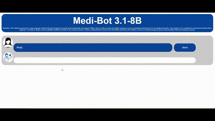
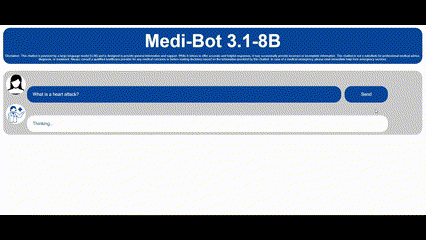

# Medi-Bot 3.1-8B

Medi-Bot 3.1-8B is a full-stack Large Language Model (LLM)-powered Retrieval-Augmented Generation (RAG) medical chatbot. The backend was built using Python -- specifically Langchain, Ollama, Pinecone, and Flask -- while the frontend was constructed using React. Medi-Bot 3.1-8B uses Meta's Llama 3.1 8B model as its LLM backbone and a Pinecone vector database containing embeddings from *The Gale Encyclopedia o Medicine (2nd edition)* to power its RAG capabilities. The diagram below expands on how the app works.

## Demo

The two GIFs below depict how to use Medi-Bot 3.1-8B. The first GIF shows how to ask a question, while the second GIF shows the app returning an answer.

*GIF 1: Shows how a user can ask Medi-Bit 3.1-8B a question.*

*GIF 2: Shows Medi-Bot 3.1-8B returning an answer to the question asked in GIF 1.*

**Please note: at this time, Medi-Bot 3.1-8B requires the user to have a GPU if they'd like to use the app locally. However, I am planning on deploying this app to AWS so anyone can use it via the Internet.**

## References

1. [*The Gale Encyclopedia of Medicine (2nd edition)*](./data/The_GALE_ENCYCLOPEDIA_of_MEDICINE_SECOND.pdf)
2. ["Generative AI Full Course – Gemini Pro, OpenAI, Llama, Langchain, Pinecone, Vector Databases & More" (YouTube)](https://youtu.be/mEsleV16qdo?si=1axq3s0vsaCgHWAf)
3. ["File:User (17238) - The Noun Project.svg" (Wikimedia Commons)](https://commons.wikimedia.org/wiki/File:User_%2817238%29_-_The_Noun_Project.svg)
4. ["File:Noun-doctor-2909354-00449F.svg" (Wikimedia Commons)](https://commons.wikimedia.org/wiki/File:Noun-doctor-2909354-00449F.svg)